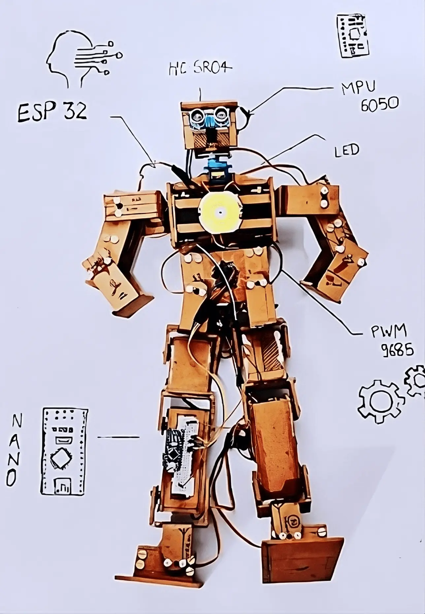
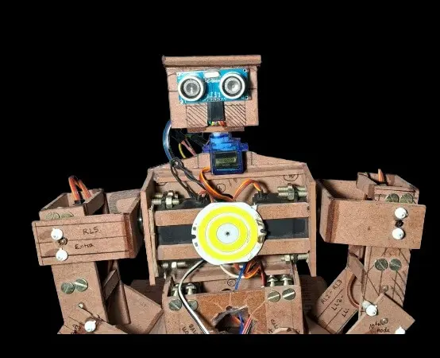
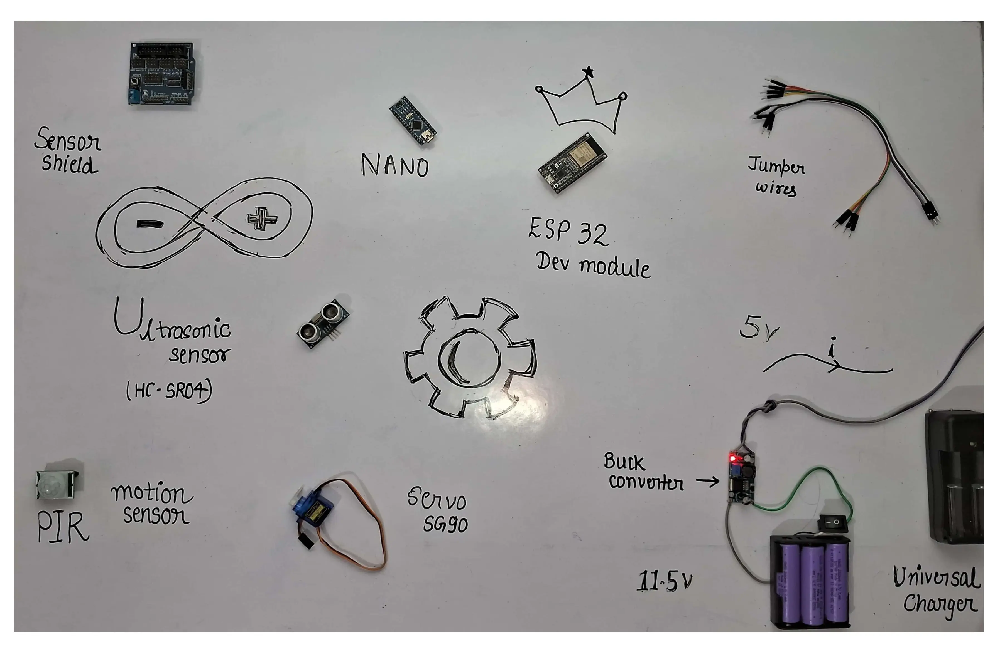
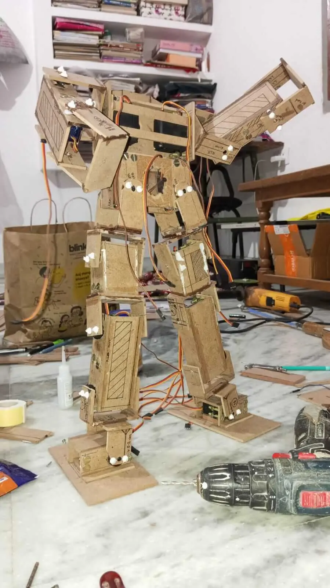

# PGNTA: 17 DOF Humanoid Arduino Robot

## Introduction
During my first-year summer break, I embarked on an ambitious project to create PGNTA, a humanoid Arduino robot. This project was born out of a fascination with robotics and a desire to challenge myself in the fields of electronics, programming, and mechanical design. PGNTA, standing at 53 cm tall, represents my first foray into complex robotics and serves as a testament to what can be achieved with determination and a willingness to learn.

(inspired by Tony Stark)

## Project Overview
PGNTA is a 17 Degree of Freedom (DOF) humanoid robot powered by an ESP32 microcontroller. Built primarily from wooden plywood, it combines servo motors, sensors, and custom-designed joints to create a functional bipedal structure.

### Key Features:
- 17 DOF using [MG995](webimages/hardware/mg995.webp) and [SG90](webimages/hardware/sg90.webp) servo motors
- [ESP32](webimages/hardware/esp32.webp) microcontroller for main control
- Custom wooden plywood frame
- Ultrasonic sensor ([HC-SR04](webimages/hardware/hcsr04.webp)) and ([MPU6050](webimages/hardware/mpu6050.webp)) for balance and object detection
- [Arduino Cloud integration] for live data fetching
- Dimensions: 53 cm height, 25 cm length, 8 cm width

### Objectives:
1. Design and build a functional humanoid robot using Arduino technology
2. Gain practical experience in servo motor control and power management
3. Explore challenges in balance and movement for bipedal structures
4. Create a platform for future enhancements and learning in robotics
5. Integrate sensors and cloud connectivity for advanced functionality

## Development Process
### 1. Component Selection
The construction of PGNTA involved careful selection of components to balance functionality, cost, and availability. The key components included:
- Servo Motors: 14 [MG995](webimages/hardware/mg995.webp) high-torque servos for major joints and 3 [SG90](webimages/hardware/sg90.webp) servos for less demanding movements
- Microcontroller: [ESP32](webimages/hardware/esp32.webp) for main control
- Sensors: Ultrasonic sensor ([HC-SR04](webimages/hardware/hcsr04.webp)) for object detection and [MPU6050](webimages/hardware/mpu6050.webp) for acceleration and gyroscopic data
- Additional electronics: [PCA9685](webimages/hardware/pca9685.webp) 16-channel servo driver, Arduino Nano for interfacing with servo control software

### 2. Structural Design
PGNTA's structure was primarily built using 3mm wooden plywood, chosen for its availability, ease of modification, and cost-effectiveness. The robot's frame consists of:
- Central body: 14x11 cm plywood housing core servos
- Limbs: Custom box-like structures using smaller plywood pieces
- Joints: C-shaped hinge joints created from plywood for flexibility
- Head: 6x3x5 cm cube-shaped structure housing sensors

### 3. Servo Configuration
The 17 servos were strategically placed to mimic human joint movements:
- Legs (10 servos): LL1-LL5 and RL1-RL5
- Arms (6 servos): LH1-LH3 and RH1-RH3
- Head (1 servo): For rotational movement

### 4. Power Management
Initial power supply using 9V batteries proved insufficient. The final solution involved:
- Six 18650 2000mAh 3.7V batteries
- Configuration: 2 parallel sets of 3 batteries in series
- Output: Approximately 11.5V with higher current capacity
- DC-DC Buck converter providing 5V output

### 5. Programming and Control
- Arduino IDE was used for programming
- PWM control implemented for servo movements
- Tim's Servo x16 Controller utilized for fine-tuning servo positions
- Integration with Arduino Cloud for remote monitoring and control

## Circuit Documentation
### ESP32 Version
This circuit manages precise servo motor movements using an Adafruit PCA9685 PWM Servo Breakout board, interfaced with an ESP32 microcontroller.

#### Component List:
- ESP32: Interfaces with the servo control software and manages PWM signals.
- 18650 Li-ion Batteries: Rechargeable batteries providing the power source.
- Adafruit PCA9685 PWM Servo Breakout: 16-channel, 12-bit PWM I2C-controlled servo driver.
- Servos: Actuators precisely controlled for position.
- Terminal PCB 2 Pin: Connectors for power supply.
- Electrolytic Capacitor: 25V 100μF capacitor for voltage smoothing.
- Ultrasonic Sensor (HC-SR04): For object detection.
- MPU6050: For acceleration and gyroscopic data.
- Circular LED: Connected to the ESP32 for visual indication.

#### Wiring Details:
(Detailed wiring information for ESP32, sensors, and servos)

### Arduino Nano Version
This circuit is an alternative version using an Arduino Nano microcontroller.

#### Component List:
- Arduino Nano: Based on the ATmega328, interfacing with the servo control software.
- 18650 Li-ion Batteries: Rechargeable batteries providing the power source.
- Adafruit PCA9685 PWM Servo Breakout: 16-channel, 12-bit PWM I2C-controlled servo driver.
- Servos: Actuators precisely controlled for position.
- Terminal PCB 2 Pin: Connectors for power supply.
- Electrolytic Capacitor: 25V 100μF capacitor for voltage smoothing.

#### Wiring Details:
(Detailed wiring information for Arduino Nano, sensors, and servos)

## Code
Will be uploaded soon on my GitHub account
- [ESP32 Version](code/esp32_iot.ino)
- [Arduino Nano Version](code/nano.html)

## Challenges & Solutions
1. **Servo Movement Limitations:**
   - **Challenges:** MG995 servos mechanically limited to 0-180 degrees.
   - **Solutions:** Used Tim's Servo x16 Controller software to fine-tune servo positions and created preset configurations and scripts for movements.

2. **Power Supply Issues:**
   - **Challenge:** Initial power supply (9V batteries) insufficient for high current draw.
   - **Solution:** Switched to 18650 Li-ion batteries for higher current capacity and implemented a 2S3P configuration for balanced voltage and current.

3. **Weight Management:**
   - **Challenge:** Excessive weight due to 3mm plywood frame.
   - **Solution:** Future versions to consider lighter materials and ongoing optimization of design for weight reduction.

4. **Assembly Mistakes:**
   - **Challenges:** Servos joined to body without prior testing, restricting some motions.
   - **Solution:** Learned importance of component testing before final assembly and future iterations to include modular design for easier modifications.

5. **Wiring and Connections:**
   - **Challenge:** Improper soldering of pins in PWM 9685 boards caused connection issues.
   - **Solutions:** Re-soldered connections using 30-watt soldering iron and gained hands-on soldering experience.

## Future Improvements (Planned Phases)
### Version 2
- Implement web-based control interface
- Enhance movement fluidity and range

### Version 3
- Integrate ESP32-CAM module for image detection
- Implement real-time movement following human actions

### Version 4
- Integrate AI API for advanced interactions
- Implement voice control and natural language processing
